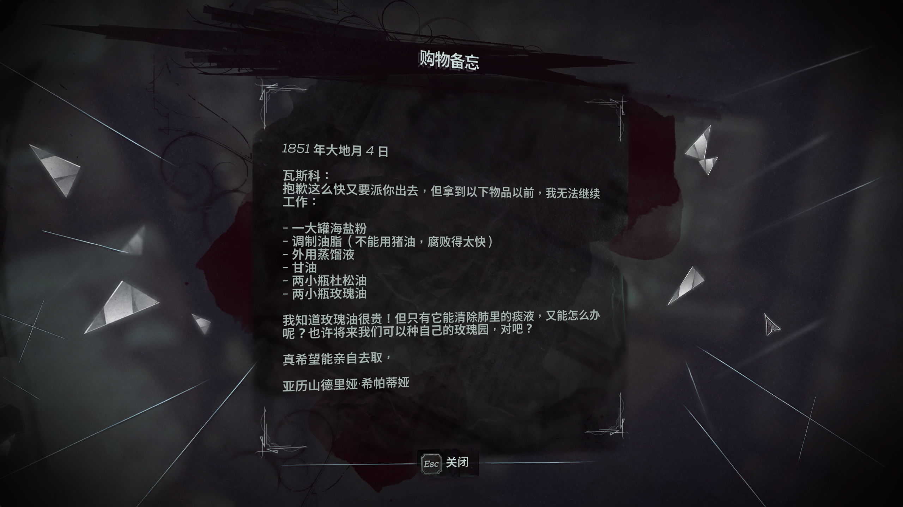
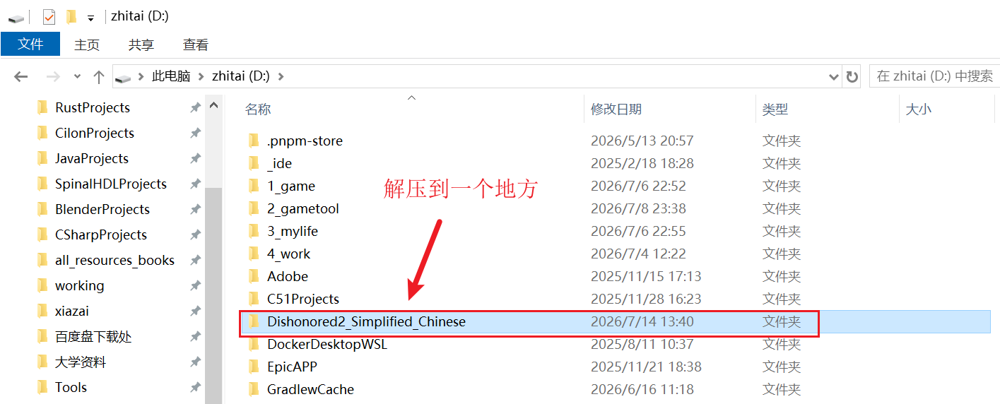
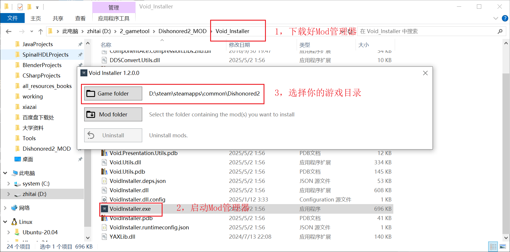
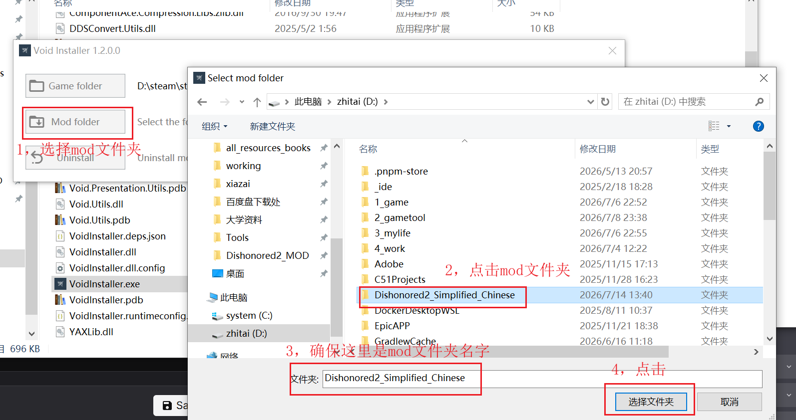
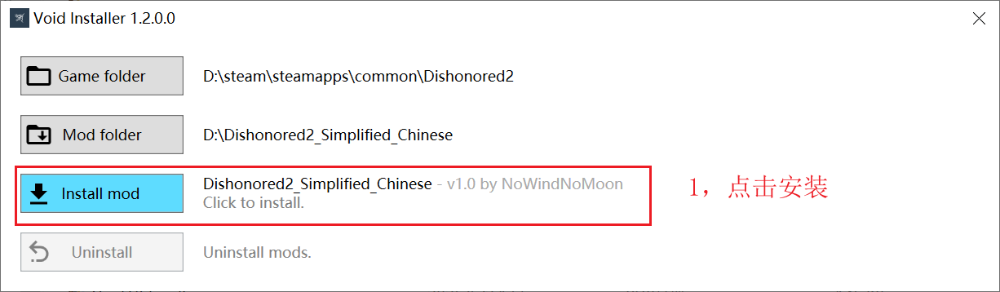
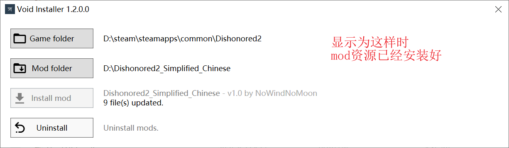
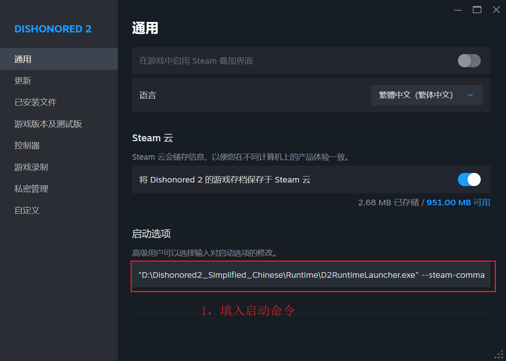

<div align="center">

# 《耻辱2》简体中文翻译

### Complete Simplified Chinese Translation for Dishonored 2

**高质量简体中文本地化，覆盖菜单、界面、任务、书信、日志、对白字幕与中文字体。**

当前版本：**v1.1**


</div>

## 下载

请前往本仓库的 [Releases](https://github.com/intergra/Dishonored_2_Simplified_Chinese_Translation/releases) 页面下载：

```text
Dishonored2_Simplified_Chinese.zip
```

> [!IMPORTANT]
> 请下载 Release 页面中单独提供的 `Dishonored2_Simplified_Chinese.zip`。GitHub 自动生成的
> `Source code (zip)` 和 `Source code (tar.gz)` 不是可安装的 MOD。

当前 v1.1 安装包：

- 大小：`53,052,763` 字节
- SHA-256：`4C93614528D208AD5E12FE8020A99D3ABA733A01C2291AB5856DF14898661F57`

## Overview / 简介

本 MOD 为《Dishonored 2 / 耻辱2》制作完整简体中文翻译，覆盖主菜单、HUD、任务目标、
教程、技能与物品说明、书信、日志、环境文本、剧情对白和游戏内字幕。

翻译以**官方英文原文为最高依据**，官方繁体中文仅作为参考。项目并非把繁体机械转换
为简体，而是结合剧情语境、人物身份、组织性质、时代气质和中国大陆玩家的阅读习惯，
对误译、漏译、港台用语、术语不统一和不自然表达进行重新审校。

整体文字风格尽量保持《Dishonored》系列冷峻、克制、阴暗的工业奇幻气质。任务目标、
技能说明和 UI 文本以清晰准确为先；对白、书信和日志则在不擅自加戏的前提下保留人物
语气和世界观氛围。

本 MOD 同时重建游戏的中文字体资源。全部可绘制 CJK 槽统一使用 **Noto Sans SC /
思源黑体简体 600** 字重，并校正字面大小、笔画重叠和垂直基线，避免简繁字体混排、
缺字、碎笔、灰影以及大量 `~` 的问题。

当前正式方案由两部分组成：

- **Void 静态资源层：**安装主语言表、中文字体和安全的对白资源，保证菜单、界面与
  字体能够正常加载。
- **运行时完整对白层：**从 Steam 启动游戏时加载全部精校对白，在保留游戏原版地图、
  角色、存档和语音声明生命周期的前提下替换既有字幕文本槽。



## Important Notes / 重要说明

1. 当前只支持经项目验证的 **Windows x64 Steam 版 `Dishonored2.exe 1.77.9.0`**。
2. 安装静态资源需要前置工具
   [Void Installer](https://www.nexusmods.com/dishonored2/mods/31) (作者：FCH823)。
   请从该页面下载并解压最新版本；本 MOD 不包含 Void Installer。
3. 完整对白翻译需要设置一次 **Steam 启动选项**。只安装 Void 资源而不设置启动选项，
   无法获得全部精校对白。
4. 请在 Steam 中把游戏语言设置为 **中文（繁体）**。本 MOD 使用游戏原有中文槽位，
   不会新增独立的“简体中文”语言选项。
5. 解压后的 MOD 文件夹必须长期保留。Steam 启动选项会从该目录加载运行时组件。
6. 不要叠加安装旧版、测试包或其他修改中文文本和中文字体的 MOD。
7. 本 MOD 不包含游戏本体。使用前必须拥有并安装正版游戏。

## Main Features / 主要内容

### 1. 简体中文菜单、界面与主文本

项目审计官方英文主语言表的 6,229 个文本键，完整覆盖官方中文主表的 6,225 个键，
并补入 2 条官方英文存在、但官方繁体缺失的可用文本。

覆盖内容包括但不限于：

- 主菜单、暂停菜单、保存与载入界面
- HUD、互动提示、警告和系统消息
- 任务目标、任务日志和剧情摘要
- 教程、技能、能力与升级说明
- 物品、武器、护符和骨符说明
- 书信、日志、公告、报纸和世界观文本
- 视频、画质、声音、操作和辅助设置

界面用语按中国大陆 PC 玩家习惯整理，例如统一“鼠标”“屏幕”“分辨率”“显卡”
“视频设置”“保存”“载入”等表达。图形质量等级使用“非常高”和“最高”，避免同一
菜单中出现两个含义不清的“极高”。

### 2. 全部游戏内对白与字幕

项目从 `game1`、`game2`、`game3` 的官方中文资源中提取并审计：

- 1,722 个 localized speech 物理目标
- 1,631 个唯一 `speechScene` / `speechBarks` 声明
- 9,098 个语音行
- 9,900 个可编辑字幕文本槽

正式运行时目录为每个字幕槽保存完整精校译文，支持在不受官方繁体字数限制的情况下
调整语序、增删字和重写句子。声明名称、行数、顺序、角色、音频关联、分支结构和
所有非文本字段保持不变。

翻译 DLL 不重建整份语音声明，也不接管地图、存档、死亡回档、音频或事件系统。它只
在引擎完成原版声明加载后，调用引擎自己的字符串赋值逻辑修改既有字幕槽，因此能够
继续使用游戏原生资源生命周期。

### 3. 完整简体中文字体支持

中文字体采用 **Noto Sans SC / 思源黑体简体 600**，统一重绘 3,938 个可绘制 CJK
字形槽：

- 保持原版字体 4,217 个字符和原版码点表不变
- 覆盖独立中文字体及主菜单、HUD、暂停菜单等全部 18 个界面字体依赖
- 统一中文字面大小、笔画粗细和垂直基线
- 修复复杂汉字交叠轮廓造成的碎笔、缺口和灰影
- 主语言表、静态对白和运行时完整译文统一参与缺字审计
- 编码缺字和视觉回译错误均为 0

字体依据 SIL Open Font License 1.1 使用，许可证文件随发布包提供。

### 4. 翻译原则

1. 英文原文是判断含义的最高依据。
2. 结合世界观、剧情流程、人物关系、身份和说话场景。
3. 使用符合中国大陆玩家习惯和游戏行业约定的表达。
4. 人物、地点、组织、技能和物品译名按上下文保持一致。
5. 任务目标、教程、技能和 UI 优先保证清晰，不为文采牺牲玩法信息。
6. 对白、书信和日志保持克制，不添加原文没有的梗、情绪或剧情信息。
7. 保留变量、占位符、标签、转义、换行语义和所有技术控制结构。

### 5. 安全构建与验证

- 从官方资源只读提取并重新构建，不在旧 MOD 成品上叠加修改。
- 逐项验证语言表、字体、对白目录、Void 索引和压缩元数据。
- 使用原始 `master.index` 执行首次安装沙箱测试。
- 发布前回读全部 108 个 Void 资源目标。
- 启动器验证游戏 EXE 的 SHA-256 和关键机器码，版本不符时拒绝加载。
- 发布目录与 ZIP 逐文件验证大小和 SHA-256 一致。

## Package Contents / 文件内容

正式发布包固定包含 13 个文件：

- `ModInfo.xml` 与 `package-manifest.json`
- `Resources/` 中 game1、game2、game3 的 3 组 `.voidIndex` / `.voidRessources`
- `Runtime/D2RuntimeLauncher.exe`
- `Runtime/D2RuntimeTranslation.dll`
- `Runtime/speech-translations.bin`
- Noto Sans SC 的版权与 OFL 许可证文件

正式包不包含游戏本体、研究探针、调试 DLL、构建脚本、机器路径配置或运行日志。

## Recommended Environment / 推荐环境

- 操作系统：Windows x64
- 游戏版本：Steam 版 Dishonored 2，`Dishonored2.exe 1.77.9.0`
- 静态资源安装工具：[Void Installer](https://www.nexusmods.com/dishonored2/mods/31)
- Steam 游戏语言：中文（繁体）
- 推荐安装前状态：未安装其他中文文本、字幕或中文字体 MOD

玩家端**不需要**安装 Python、.NET SDK、CMake、Visual Studio 或额外 VC++ 运行库。
正式启动器和 DLL 使用静态 C/C++ 运行库构建。

## Prerequisite Tool / 前置工具

安装本 MOD 的静态资源必须使用
[Void Installer](https://www.nexusmods.com/dishonored2/mods/31)。请在其 Nexus Mods
页面的 **Files** 栏下载并解压最新版本，然后运行 `VoidInstaller.exe`。Void Installer
由 FCH823 制作，不包含在本 MOD 发布包中，也不属于本项目。

Void Installer 当前需要 **Microsoft .NET 6 Desktop Runtime x64**。如果
`VoidInstaller.exe` 可以正常打开，无需重复安装；如果系统提示缺少 .NET 运行环境，
请从 [Microsoft 官方 .NET 6 下载页面](https://dotnet.microsoft.com/en-us/download/dotnet/6.0)
安装 Windows x64 的 **.NET Desktop Runtime 6.0**。该运行环境仅供 Void Installer
使用，本 MOD 自带的运行时组件不依赖 .NET。

## Installation / 安装方法

1. 从 [Releases](https://github.com/intergra/Dishonored_2_Simplified_Chinese_Translation/releases)
   下载 `Dishonored2_Simplified_Chinese.zip`。
2. 把 ZIP 解压到一个长期保留的目录。解压后应得到
   `Dishonored2_Simplified_Chinese` 文件夹，第一层可以直接看到 `ModInfo.xml`、
   `Resources` 和 `Runtime`。
3. 打开已单独下载并解压的
   [Void Installer](https://www.nexusmods.com/dishonored2/mods/31)。
4. **Game folder** 选择包含 `Dishonored2.exe` 和 `base` 的游戏根目录。
5. **Mod folder** 选择包含 `ModInfo.xml` 的 `Dishonored2_Simplified_Chinese` 文件夹，
   然后安装。
6. 在 Steam 中把《Dishonored 2》的语言设置为“中文（繁体）”。
7. 打开 Steam 的“属性 → 通用 → 启动选项”，填写下方的一行命令，并把路径替换为
   自己的实际解压路径。

### 解压后的 MOD 目录



### 在 Void Installer 中选择游戏目录



### 在 Void Installer 中选择 MOD 目录



### 在 Void Installer 中安装 MOD



### 确认 Void Installer 安装完成



```text
"你的MOD目录\Dishonored2_Simplified_Chinese\Runtime\D2RuntimeLauncher.exe" --steam-command %command%
```

例如，把文件夹放在 `D:\Dishonored2_Simplified_Chinese` 时填写：

```text
"D:\Dishonored2_Simplified_Chinese\Runtime\D2RuntimeLauncher.exe" --steam-command %command%
```

“你的MOD目录”应替换为包含盘符的完整绝对路径。命令必须保持为一整行，路径两侧使用
英文半角双引号。以后仍然从 Steam 正常点击“开始游戏”。启动器会自动读取同目录的
DLL 和翻译目录，不需要填写游戏路径。

### 设置 Steam 语言与启动选项



## Updating / 更新方法

1. 关闭游戏。
2. 使用 Void Installer 卸载旧版同名 MOD。
3. 清空旧的 Steam 启动选项，或准备在安装后更新其中的路径。
4. 旧版卸载完成后，再删除旧的解压目录。
5. 下载并解压新版 ZIP。
6. 使用 Void Installer 安装新版文件夹。
7. 重新填写指向新版 `D2RuntimeLauncher.exe` 的 Steam 启动选项。

不要把新版直接覆盖到仍处于安装状态的旧目录，也不要混用不同版本的启动器、DLL 和
翻译目录。

## Uninstallation / 卸载方法

1. 关闭游戏。
2. 打开 Void Installer，在已安装 MOD 列表中卸载本 MOD 的静态资源。
3. 打开 Steam 游戏属性，清空本 MOD 的启动选项。
4. 确认以上两步完成后，删除解压的 `Dishonored2_Simplified_Chinese` 文件夹。
5. 从 Steam 正常启动游戏，确认已经恢复原版状态。

> [!WARNING]
> Void Installer 只管理静态资源，不会自动清理 Steam 启动选项。卸载时必须完成以上
> 两个部分。

## Compatibility / 兼容性说明

- 当前只支持 Windows x64 Steam 版 `Dishonored2.exe 1.77.9.0`。
- 与其他修改 `strings/chinese_m.lang`、中文 Iggy 字体、界面字体依赖或中文
  localized speech 的 MOD 冲突。
- 不建议与旧汉化包、字体替换包或其他中文本地化 MOD 同时安装。
- 本 MOD 不修改关卡流程、敌人 AI、能力数值、武器数值、音频内容或存档格式。
- 游戏更新后如果 EXE 哈希或关键机器码发生变化，启动器会拒绝加载，需要等待兼容性
  更新。

## Technical Safety / 技术安全说明

- 不替换、不修改磁盘上的 `Dishonored2.exe`。
- 不修改游戏 `base` 原始归档；静态 MOD 资源由 Void Installer 管理和卸载。
- 运行时组件只在启动阶段验证并加载到游戏进程，不向游戏目录写入文件。
- 启动器在翻译 DLL 完成初始化并恢复游戏主线程后立即退出，不会一直驻留后台。
- 翻译 DLL 只修改当前进程内的既有字幕字符串，不重建声明，不保存跨地图对象指针。
- 运行时目录、声明身份、文本槽拓扑、UTF-8 边界和 SHA-256 均经过严格验证。
- 版本、签名、目录或结构验证失败时会停止加载，不在未知游戏版本上继续执行。

## Troubleshooting / 故障排查

### 安装后仍有繁体对白

- 确认 Steam 游戏语言已经设置为“中文（繁体）”。
- 确认 Void Installer 中已经安装本 MOD。
- 确认 Steam 启动选项仍然存在，并准确指向当前保留目录中的
  `D2RuntimeLauncher.exe`。
- 确认没有从游戏目录中的 EXE 或其他快捷方式绕过 Steam 启动。

### Steam 点击启动后立即报错

- 检查启动选项路径是否使用英文半角双引号包围。
- 确认解压目录没有被移动、改名或删除。
- 确认游戏 EXE 为受支持的 1.77.9.0 版本。
- 查看 `%LOCALAPPDATA%\NoWindNoMoon\Dishonored2SC\runtime.log` 和
  `runtime.error.txt` 中的明确错误原因。

### Void Installer 无法安装或卸载

- 关闭游戏后再操作 Void Installer。
- 不要手动删除仍处于安装状态的 MOD 资源。
- 如果曾安装早期测试包或其他会修改相同资源的 MOD，先卸载相关 MOD；必要时通过
  Steam 验证游戏文件完整性后重新安装。

### 姓名或字幕换行不自然

- 游戏会根据当前界面宽度自动换行；手动 `<br>` 不能关闭后续自动换行，在不同分辨率
  下可能产生额外行。
- 请在 Issue 中提供具体界面、分辨率和截图。本 MOD 会优先调整语序和文字长度，不会向
  不支持富文本的普通字符串强塞换行标签。

### 人物在没有按键时持续移动

- 本 MOD 不读取、模拟或修改键盘、鼠标、手柄输入，也不修改角色移动或教程逻辑。
- 退出游戏，断开实体手柄，并停止或临时禁用 vJoy、ViGEm、reWASD、DS4Windows 等
  虚拟控制器后重新启动。
- 需要对照测试时，可暂时清空 Steam 启动选项；测试完成后恢复指向
  `D2RuntimeLauncher.exe` 的原命令。

## Known Notes / 已知说明

- 游戏语言菜单仍显示“中文（繁体）”，这是因为本 MOD 使用官方中文槽位。
- 只完成 Void Installer 安装、但没有设置 Steam 启动选项时，主界面和字体可以生效，
  但无法保证全部对白使用完整精校译文。
- 从 Steam 启动时会短暂出现一个黑色命令行窗口，随后自动关闭。这是
  `D2RuntimeLauncher.exe` 的正常启动窗口，不是闪退，也不需要手动关闭。
- 运行时启动器不是常驻程序；游戏启动后在任务管理器中看不到它继续运行属于正常现象。
- 运行时翻译 DLL 会在游戏进程中工作，退出游戏后自动释放。
- 主要菜单、普通存档载入和死亡检查点回档已经实机验证；少见分支和特殊 MOD 组合仍
  欢迎反馈。

## Credits / 制作信息

**作者：** NoWindNoMoon / 此情无关风月

**简体中文字形：** Noto Sans SC / Source Han Sans SC

字体依据 SIL Open Font License 1.1 使用。第三方版权与许可详情见
[THIRD_PARTY_NOTICES.md](THIRD_PARTY_NOTICES.md)，完整字体版权声明和许可证位于发布包的
`licenses/` 目录。

游戏名称、原始文本、图像、音频和其他资产归其各自权利人所有。本 MOD 是非官方、
非商业的玩家制作项目，与 Arkane Studios、Bethesda Softworks 或 ZeniMax Media
没有隶属或认可关系。使用本 MOD 必须拥有通过合法渠道取得的游戏副本。

本仓库采用[自定义使用许可](LICENSE.md)。玩家可以下载、安装并用于个人、
非商业的正常游戏用途，也可以分享本仓库或 Release 页面的原始链接；未经许可不得
重新上传、镜像分发、公开发布修改版或进行商业利用。明确标注的第三方内容继续遵循
其各自许可证。

## Feedback / 反馈

发现问题时，请在 [GitHub Issues](https://github.com/intergra/Dishonored_2_Simplified_Chinese_Translation/issues)
提交反馈，并尽量提供出现位置、当前任务、角色、截图和 `runtime.log`：

- 繁体残留或英文残留
- 字幕缺失、错位或显示时间异常
- 文本溢出、换行不自然或字符显示异常
- 人物、地点、组织、技能或物品译名不一致
- 译文不符合英文原意、剧情语境或人物性格
- 启动、载入、检查点回档、安装、更新或卸载异常

感谢每一位测试和反馈问题的玩家。

## Version Notes / 更新摘要

### v1.1

- 完整覆盖官方中文主语言表，并补入官方繁体缺失的可用文本。
- 建立 1,631 个唯一对白声明、9,900 个字幕文本槽的完整运行时翻译目录。
- 以英文原文为最高依据，重新审校 UI、任务、教程、书信、日志和对白文本。
- 统一大陆 PC 游戏常用界面表达，修正误译、漏译、港台用语和术语不一致。
- 使用 Noto Sans SC 600 统一重建 3,938 个可绘制 CJK 字形槽。
- 修复中文字体缺字、`~`、风格混排、垂直偏移、碎笔和灰影问题。
- 修复早期语言资源压缩错误、字体依赖遗漏和整声明重载导致的载入、死亡回档退出问题。
- 修正教程加载与角色说明中完整姓名可能被自动换行拆开的排版问题。
- 正式包支持 Void Installer 自由安装和卸载，并通过 Steam 启动选项加载完整对白翻译。
