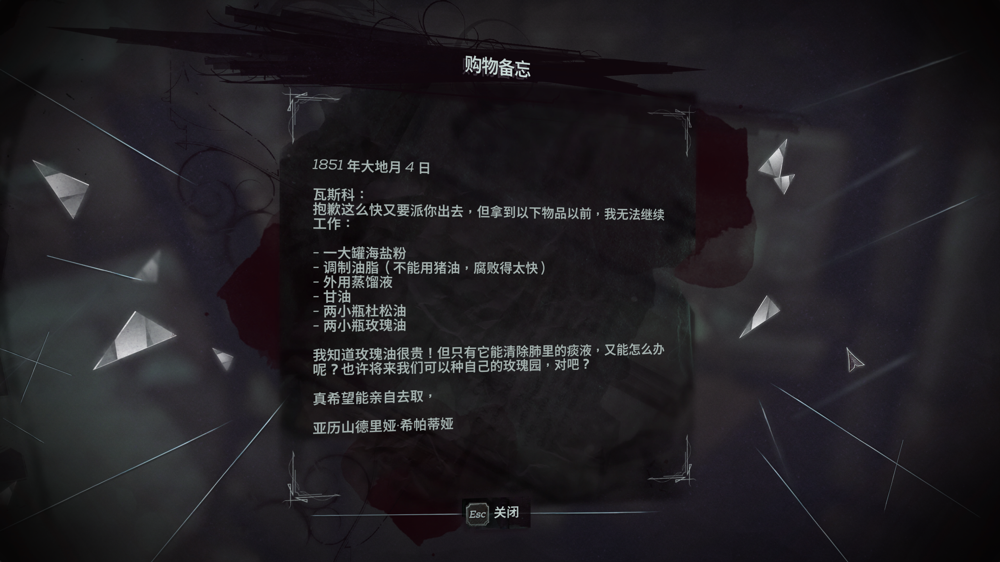
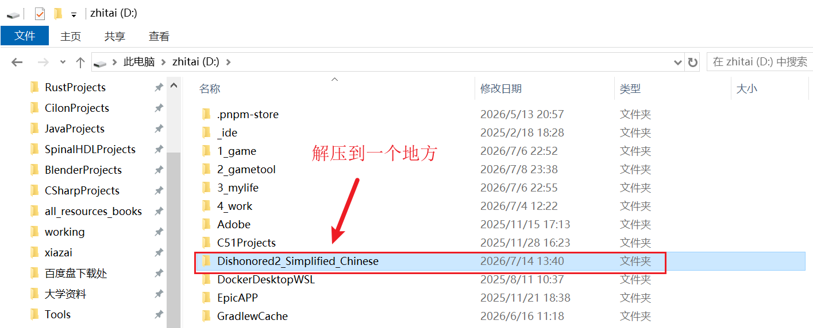
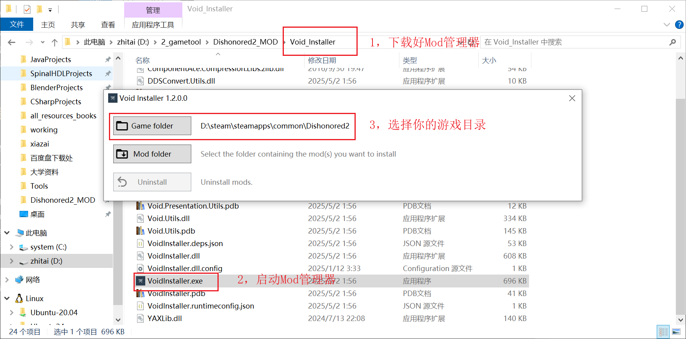
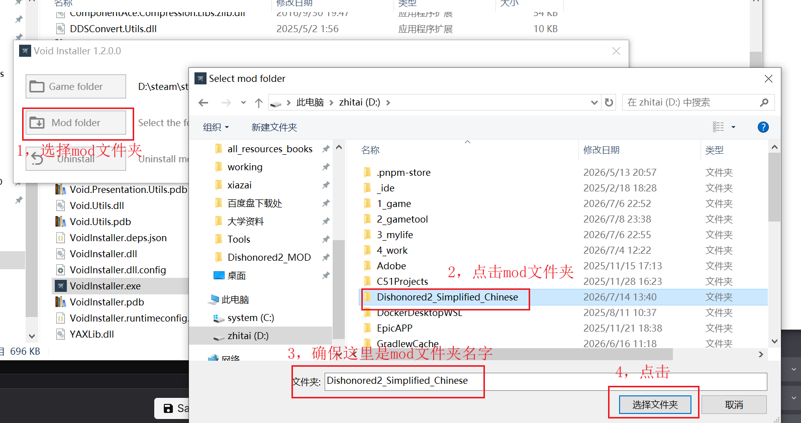
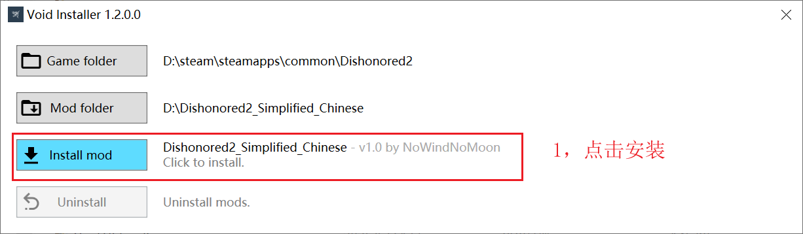
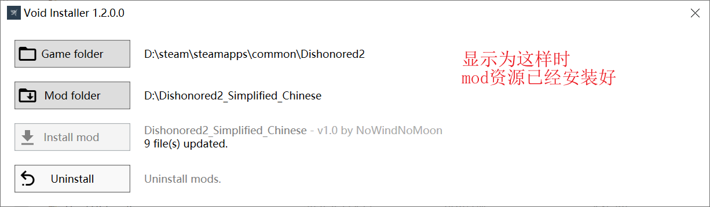
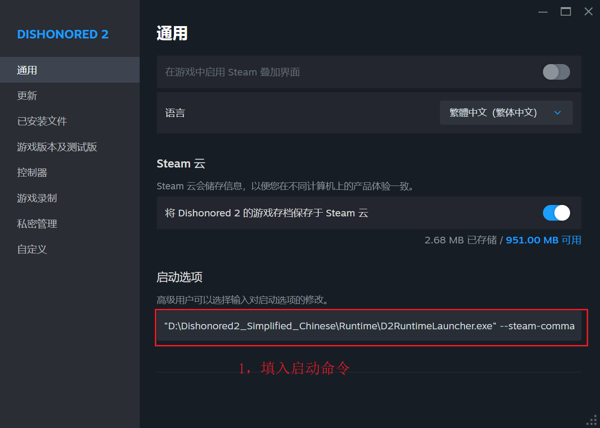

<div align="center">

# 《耻辱2》简体中文翻译

### Complete Simplified Chinese Translation for Dishonored 2

**高质量简体中文本地化，覆盖菜单、界面、任务、书信、日志、对白字幕与中文字体。**


</div>

## 下载

请前往本仓库的 [最新 Release](https://github.com/intergra/Dishonored_2_Simplified_Chinese_Translation/releases/latest) 页面下载：

```text
Dishonored2_Simplified_Chinese.zip
```

> [!IMPORTANT]
> 请下载 Release 页面中单独提供的最新 `Dishonored2_Simplified_Chinese.zip`。GitHub 自动生成的
> `Source code (zip)` 和 `Source code (tar.gz)` 不是可安装的 MOD。

## Overview / 简介

本 MOD 为《Dishonored 2 / 耻辱2》制作完整简体中文翻译，覆盖主菜单、HUD、任务目标、
教程、技能与物品说明、书信、日志、环境文本、剧情对白和游戏内字幕。

翻译以**官方英文原文为最高依据**，官方繁体中文仅作为参考。项目并非把繁体机械转换
为简体，而是结合剧情语境、人物身份、组织性质、时代气质和中国大陆玩家的阅读习惯，
对误译、漏译、港台用语、术语不统一和不自然表达进行重新审校。

人物、地点、组织、能力、物品及世界观专名优先对齐《耻辱》Wiki 对应专页和本作分节
中已明确的中文名称，并检查这些名称在任务、文献和对白中的关联用法。英文原文仍是
判断含义的依据；Wiki 缺少明确中文对照或存在歧义时，结合本作语境和项目规定处理，
不按网页标题机械替换普通词义。

整体文字风格尽量保持《Dishonored》系列冷峻、克制、阴暗的工业奇幻气质。任务目标、
技能说明和 UI 文本以清晰准确为先；对白、书信和日志则在不擅自加戏的前提下保留人物
语气和世界观氛围。

本 MOD 同时提供统一的中文字体，使用 **Noto Sans SC / 思源黑体简体 600** 字重，
改善中文字面大小、笔画和基线，减少简繁字体混排、缺字及显示异常。

当前正式方案由两部分组成：

- **资源安装：** 使用 Void Installer 安装中文菜单、界面、字体和对白资源。
- **完整对白：** 设置 Steam 启动选项，从长期保留的 MOD 目录加载完整对白翻译。



## Important Notes / 重要说明

1. 当前只支持经项目验证的 **Windows x64 Steam 版 `Dishonored2.exe 1.77.9.0`**。
2. 安装静态资源需要前置工具
   [Void Installer](https://www.nexusmods.com/dishonored2/mods/31) (作者：FCH823)。
   请从该页面下载并解压最新版本；本 MOD 不包含 Void Installer。
3. 完整对白翻译需要设置一次 **Steam 启动选项**。只安装 Void 资源而不设置启动选项，
   无法获得全部精校对白。
4. 请在 Steam 中把游戏语言设置为 **中文（繁体）**。本 MOD 使用游戏原有中文槽位，
   不会新增独立的“简体中文”语言选项。
5. 解压后的 MOD 文件夹必须长期保留。Steam 启动选项会从该目录加载运行时组件。
6. 不要叠加安装旧版、测试包或其他修改中文文本和中文字体的 MOD。
7. 本 MOD 不包含游戏本体。使用前必须拥有并安装正版游戏。

## Main Features / 主要内容

### 1. 简体中文菜单、界面与主文本

提供简体中文主菜单、界面和主文本，并补充官方中文缺失的可用内容。

覆盖内容包括但不限于：

- 主菜单、暂停菜单、保存与载入界面
- HUD、互动提示、警告和系统消息
- 任务目标、任务日志和剧情摘要
- 教程、技能、能力与升级说明
- 物品、武器、护符和骨符说明
- 书信、日志、公告、报纸和世界观文本
- 视频、画质、声音、操作和辅助设置

界面用语按中国大陆 PC 玩家习惯整理，例如统一“鼠标”“屏幕”“分辨率”“显卡”
“视频设置”“保存”“载入”等表达。图形质量等级使用“非常高”和“极致”，避免同一
菜单中出现两个含义不清的“极高”。

### 2. 全部游戏内对白与字幕

覆盖剧情对白、环境对话、广播、录音和游戏内字幕。译文根据人物身份、剧情分支和
说话情景整理，不受官方繁体译文字数限制。原有配音保持不变。

完整对白需要按下方说明设置 Steam 启动选项，不能只安装资源。

### 3. 完整简体中文字体支持

中文字体采用 **Noto Sans SC / 思源黑体简体 600**，用于主菜单、HUD、暂停菜单等
中文界面，统一字面、笔画粗细和基线，改善复杂汉字的碎笔、缺口和灰影。

字体依据 SIL Open Font License 1.1 使用，许可证文件随发布包提供。

### 4. 翻译原则

1. 英文原文是判断含义的最高依据。
2. 结合世界观、剧情流程、人物关系、身份和说话场景。
3. 使用符合中国大陆玩家习惯和游戏行业约定的表达。
4. 已核定专名优先与《耻辱》Wiki 对齐，人物、地点、组织、技能和物品译名按上下文保持一致。
5. 任务目标、教程、技能和 UI 优先保证清晰，不为文采牺牲玩法信息。
6. 对白、书信和日志保持克制，不添加原文没有的梗、情绪或剧情信息。
7. 保留变量、占位符、标签、转义、换行语义和所有技术控制结构。

## Package Contents / 文件内容

解压到独立文件夹后，应能直接看到以下结构；安装时选择这一层目录：

```text
Dishonored2_Simplified_Chinese/
├── ModInfo.xml
├── Resources/
├── Runtime/
│   ├── D2RuntimeLauncher.exe
│   ├── D2RuntimeTranslation.dll
│   └── speech-translations.bin
├── licenses/
└── package-manifest.json
```

`licenses/` 包含项目声明、第三方说明及 NotoSansSC 的版权与 OFL 许可证。

正式包不包含游戏本体、研究探针、调试 DLL、构建脚本、机器路径配置或运行日志。

## Recommended Environment / 推荐环境

- 操作系统：Windows x64
- 游戏版本：Steam 版 Dishonored 2，`Dishonored2.exe 1.77.9.0`
- 静态资源安装工具：[Void Installer](https://www.nexusmods.com/dishonored2/mods/31)
- Steam 游戏语言：中文（繁体）
- 推荐安装前状态：未安装其他中文文本、字幕或中文字体 MOD

玩家端**不需要**安装 Python、.NET SDK、CMake、Visual Studio 或额外 VC++ 运行库。
正式启动器和 DLL 使用静态 C/C++ 运行库构建。

## Prerequisite Tool / 前置工具

安装本 MOD 的静态资源必须使用
[Void Installer](https://www.nexusmods.com/dishonored2/mods/31)。请在其 Nexus Mods
页面的 **Files** 栏下载并解压最新版本，然后运行 `VoidInstaller.exe`。Void Installer
由 FCH823 制作，不包含在本 MOD 发布包中，也不属于本项目。

Void Installer 当前需要 **Microsoft .NET 6 Desktop Runtime x64**。如果
`VoidInstaller.exe` 可以正常打开，无需重复安装；如果系统提示缺少 .NET 运行环境，
请从 [Microsoft 官方 .NET 6 下载页面](https://dotnet.microsoft.com/en-us/download/dotnet/6.0)
安装 Windows x64 的 **.NET Desktop Runtime 6.0**。该运行环境仅供 Void Installer
使用，本 MOD 自带的运行时组件不依赖 .NET。

## Installation / 安装方法

1. 从 [Releases](https://github.com/intergra/Dishonored_2_Simplified_Chinese_Translation/releases)
   下载 `Dishonored2_Simplified_Chinese.zip`。
2. 把 ZIP 解压到游戏目录之外、一个长期保留的独立目录，例如 `Dishonored2_Simplified_Chinese`。
   ZIP 内直接包含安装文件，请认准能看到 `ModInfo.xml`、`Resources` 和 `Runtime`
   的目录，不要把外层目录误选为 MOD 目录。
3. 打开已单独下载并解压的
   [Void Installer](https://www.nexusmods.com/dishonored2/mods/31)。
4. **Game folder** 选择包含 `Dishonored2.exe` 和 `base` 的游戏根目录。
5. **Mod folder** 选择包含 `ModInfo.xml` 的 `Dishonored2_Simplified_Chinese` 文件夹，
   然后安装。
6. 在 Steam 中把《Dishonored 2》的语言设置为“中文（繁体）”。
7. 打开 Steam 的“属性 → 通用 → 启动选项”，填写下方的一行命令，并把路径替换为
   自己的实际解压路径。

### 解压后的 MOD 目录



### 在 Void Installer 中选择游戏目录



### 在 Void Installer 中选择 MOD 目录



### 在 Void Installer 中安装 MOD



### 确认 Void Installer 安装完成



```text
"你的MOD目录\Runtime\D2RuntimeLauncher.exe" --steam-command %command%
```

例如，把文件夹放在 `D:\Dishonored2_Simplified_Chinese` 时填写：

```text
"D:\Dishonored2_Simplified_Chinese\Runtime\D2RuntimeLauncher.exe" --steam-command %command%
```

“你的MOD目录”应替换为包含盘符的完整绝对路径。命令必须保持为一整行，路径两侧使用
英文半角双引号。以后仍然从 Steam 正常点击“开始游戏”。启动器会自动读取同目录的
DLL 和翻译目录，不需要填写游戏路径。

### 设置 Steam 语言与启动选项



## Updating / 更新方法

1. 关闭游戏。
2. 使用 Void Installer 卸载旧版同名 MOD。
3. 清空旧的 Steam 启动选项，或准备在安装后更新其中的路径。
4. 旧版卸载完成后，再删除旧的解压目录。
5. 下载并解压新版 ZIP。
6. 使用 Void Installer 安装新版文件夹。
7. 重新填写指向新版 `D2RuntimeLauncher.exe` 的 Steam 启动选项。

不要把新版直接覆盖到仍处于安装状态的旧目录，也不要混用不同版本的启动器、DLL 和
翻译目录。

## Uninstallation / 卸载方法

1. 关闭游戏。
2. 打开 Void Installer，在已安装 MOD 列表中卸载本 MOD 的静态资源。
3. 打开 Steam 游戏属性，清空本 MOD 的启动选项。
4. 确认以上两步完成后，删除解压的 `Dishonored2_Simplified_Chinese` 文件夹。
5. 从 Steam 正常启动游戏，确认已经恢复原版状态。

> [!WARNING]
> Void Installer 只管理静态资源，不会自动清理 Steam 启动选项。卸载时必须完成以上
> 两个部分。

## Compatibility / 兼容性说明

- 当前只支持 Windows x64 Steam 版 `Dishonored2.exe 1.77.9.0`。
- 与其他修改中文文本、字幕或中文字体的 MOD 可能冲突。
- 不建议与旧汉化包、字体替换包或其他中文本地化 MOD 同时安装。
- 本 MOD 不修改关卡流程、敌人 AI、能力数值、武器数值、音频内容或存档格式。
- 游戏更新后若启动器提示版本不兼容，请等待兼容性更新，不要混入其他包的文件。

## Known Notes / 已知说明

- 游戏语言菜单仍显示“中文（繁体）”，这是因为本 MOD 使用官方中文槽位。
- 只完成 Void Installer 安装、但没有设置 Steam 启动选项时，主界面和字体可以生效，
  但无法保证全部对白使用完整精校译文。
- 从 Steam 启动时会短暂出现一个黑色命令行窗口，随后自动关闭。这是
  `D2RuntimeLauncher.exe` 的正常启动窗口，不是闪退，也不需要手动关闭。
- 运行时启动器不是常驻程序；游戏启动后在任务管理器中看不到它继续运行属于正常现象。
- 运行时翻译 DLL 会在游戏进程中工作，退出游戏后自动释放。
- 如遇菜单、存档载入、死亡检查点回档或少见分支的问题，欢迎提供具体位置与截图。

## Credits / 制作信息

**作者：** NoWindNoMoon / 此情无关风月

**简体中文字形：** Noto Sans SC / Source Han Sans SC

字体依据 SIL Open Font License 1.1 使用。第三方版权与许可详情见
[第三方许可说明](licenses/THIRD_PARTY_NOTICES.md)，完整字体版权声明和许可证位于发布包的
`licenses/` 目录。

游戏名称、原始文本、图像、音频和其他资产归其各自权利人所有。本 MOD 是非官方、
非商业的玩家制作项目，与 Arkane Studios、Bethesda Softworks 或 ZeniMax Media
没有隶属或认可关系。使用本 MOD 必须拥有通过合法渠道取得的游戏副本。

本仓库采用[自定义使用许可](licenses/LICENSE.md)。玩家可以下载、安装并用于个人、非商业的
正常游戏用途，也可以在保留作者、项目地址、许可文件及“非官方搬运/镜像”标注的
前提下，免费传播完整且未经修改的官方发布包。不得发布删减版、修改版、衍生版、
二次整合版，也不得进行任何商业化使用。明确标注的第三方内容继续遵循其各自许可证。

## Support / 赞赏支持

如果这个项目对您有帮助，欢迎打赏支持，您的每一份支持都是我持续更新的动力!

<table>
  <tr>
    <td align="center" width="50%">
      <br>
      <strong>支付宝赞赏</strong>
    </td>
    <td align="center" width="50%">
      <br>
      <strong>微信赞赏</strong>
    </td>
  </tr>
</table>


## Troubleshooting / 故障排查

### 安装后仍有繁体对白

- 确认 Steam 游戏语言已经设置为“中文（繁体）”。
- 确认 Void Installer 中已经安装本 MOD。
- 确认 Steam 启动选项仍然存在，并准确指向当前保留目录中的
  `D2RuntimeLauncher.exe`。
- 确认没有从游戏目录中的 EXE 或其他快捷方式绕过 Steam 启动。

### Steam 点击启动后立即报错

- 检查启动选项路径是否使用英文半角双引号包围。
- 确认解压目录没有被移动、改名或删除。
- 确认游戏 EXE 为受支持的 1.77.9.0 版本。
- 查看 `%LOCALAPPDATA%\NoWindNoMoon\Dishonored2SC\runtime.log` 和
  `runtime.error.txt` 中的明确错误原因。

### Void Installer 无法安装或卸载

- 关闭游戏后再操作 Void Installer。
- 不要手动删除仍处于安装状态的 MOD 资源。
- 如果曾安装早期测试包或其他会修改相同资源的 MOD，先卸载相关 MOD；必要时通过
  Steam 验证游戏文件完整性后重新安装。
- 如果选择 MOD 时出现空引用错误，请保留错误信息与安装器备份并联系作者，
  不要手动删除备份。

### 姓名或字幕换行不自然

- 游戏会根据当前界面宽度自动换行；手动 `<br>` 不能关闭后续自动换行，在不同分辨率
  下可能产生额外行。
- 请在 Issue 中提供具体界面、分辨率和截图。本 MOD 会优先调整语序和文字长度，不会向
  不支持富文本的普通字符串强塞换行标签。

### 人物在没有按键时持续移动

- 本 MOD 不读取、模拟或修改键盘、鼠标、手柄输入，也不修改角色移动或教程逻辑。
- 退出游戏，断开实体手柄，并停止或临时禁用 vJoy、ViGEm、reWASD、DS4Windows 等
  虚拟控制器后重新启动。
- 需要对照测试时，可暂时清空 Steam 启动选项；测试完成后恢复指向
  `D2RuntimeLauncher.exe` 的原命令。

## Feedback / 反馈

发现问题时，请在 [GitHub Issues](https://github.com/intergra/Dishonored_2_Simplified_Chinese_Translation/issues)
提交反馈，并尽量提供出现位置、当前任务、角色、截图和 `runtime.log`：

- 繁体残留或英文残留
- 字幕缺失、错位或显示时间异常
- 文本溢出、换行不自然或字符显示异常
- 人物、地点、组织、技能或物品译名不一致
- 译文不符合英文原意、剧情语境或人物性格
- 启动、载入、检查点回档、安装、更新或卸载异常

感谢每一位测试和反馈问题的玩家。
